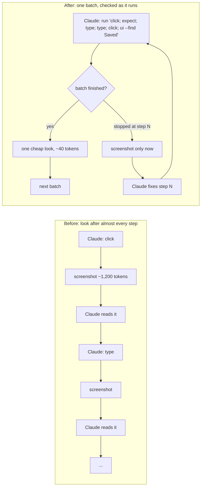
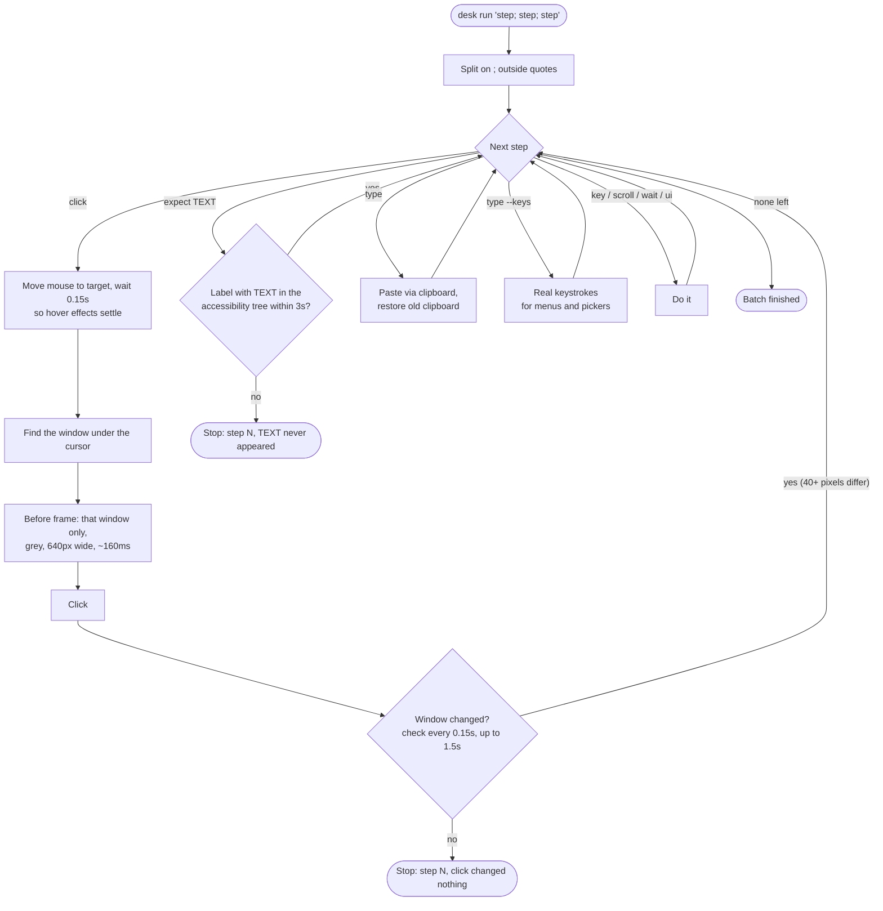
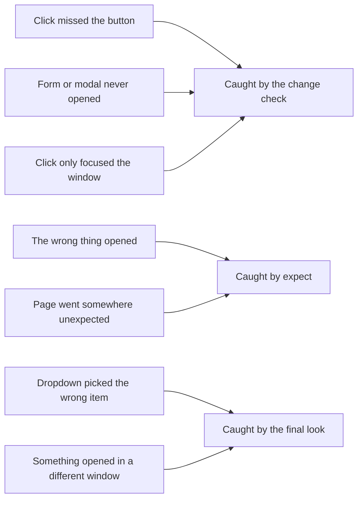
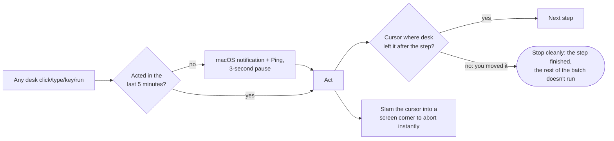

# How `desk` works

`desk` gives Claude Code eyes and hands on the Mac. Claude decides what to do and reads the screen; `desk` only
captures and acts. Every round trip to Claude costs 5–15 seconds, so the goal is to send whole batches and only
look again when something goes wrong.

## The loop, before and after

## What happens inside one `desk run`

## Why the change check doesn't get fooled

| Noise | How it's handled |
|---|---|
| The terminal next to it (Claude's spinner, scrolling output) | Only the clicked window is compared. |
| Hover highlights on the target | The mouse moves there first, and the "before" frame is taken after the hover. |
| Blinking text caret (~15 px) | A change needs 40+ pixels. An opened form or menu is thousands. |
| Menu-bar clock | Only matters when no window is under the click (Dock, desktop), and then the menu bar is blanked. |

## What it catches, and what it doesn't

A very small change (a single checkbox tick) can read as "changed nothing." That stops the batch, which is the safe
way to be wrong: Claude takes a screenshot instead of carrying on blind.

## Safety around all of it

Moving the mouse yourself is the gentle stop: `desk` finishes the step it's on, then hands the mouse back. Claude
never moves the cursor between steps, so any move there is you. The check costs well under a millisecond per step.
The corner slam is the emergency stop, and it can interrupt mid-step.

Submitting, sending, buying and deleting are still one click at a time, after asking in chat.

## Costs

| | Time | Tokens |
|---|---|---|
| Change check per click | ~0.3–1.5 s | 0 |
| `expect` | ≤ 3 s | 0 |
| `ui --find` look | < 1 s | ~40 |
| Screenshot look | ~1 s | ~1,200 |
| One Claude round trip | 5–15 s | the screenshot plus reasoning |

Today a LinkedIn "add project" form took about 6 round trips. Batched with these checks it should take about 2 (an estimate, not yet measured).
